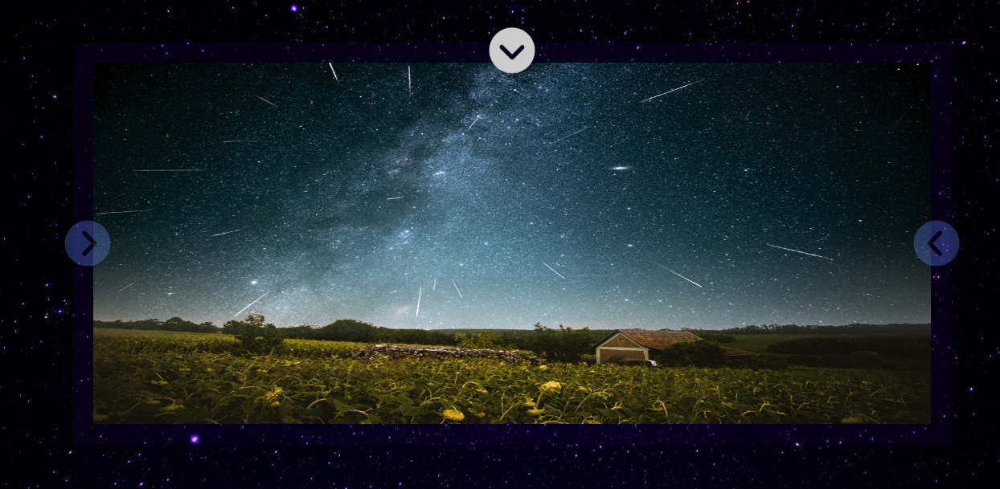

# ⚛️ Nasa Gallery 🛸

> ### A gallery of the latest NASA’s Astronomy Picture of the Day.


## Built with

- Nasa API
- ReactJS
- GSAP
- JEST
- React-testing-library

## LIVE PREVIEW

[](https://www.loom.com/share/dbe7c965c742484f87d03a23706fb584)

## LIVE DEMO

http://abdoamin.me/Nasa-Gallery/

### Setup

1- Clone the repository

```
    git clone https://github.com/AbdelrhmanAmin/StartFI-Task.git
```

2- Open the folder.

```
    cd StartFI-Task
```

3- install the app

```
    npm install
```

4- Run the app

```
    npm start
```

5- Test the app

```
    npm test
```

## Author

😎 **Abdo Amin**

- GitHub: [@Abdelrhman-Amin](https://github.com/AbdelrhmanAmin)
- LinkedIn: [@Abdo Amin](https://www.linkedin.com/in/abdoamin/)

## Show your support

Give a ⭐️ if you like this project!
